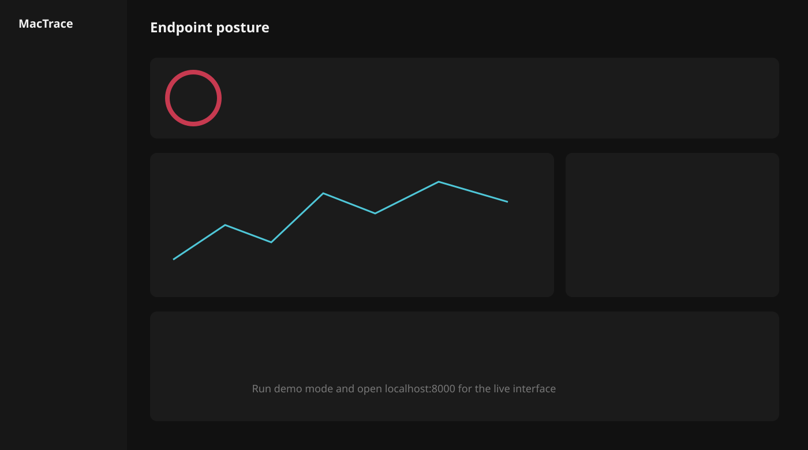
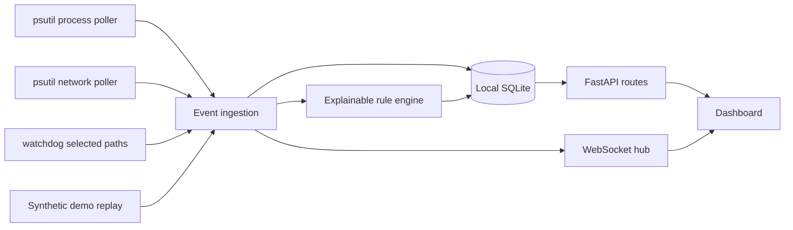

# MacTrace

[](https://github.com/nicktperez/MacTrace/actions/workflows/ci.yml)

MacTrace is a local-first macOS endpoint activity monitor and investigation dashboard. It
collects security-relevant **metadata** from a Mac you control, evaluates that activity with
plain-language rules, and presents evidence through a responsive dashboard at
`http://localhost:8000`.

It is an educational endpoint visibility project and portfolio application—not a replacement
for commercial EDR, antivirus, or incident-response tooling. Its alerts describe behavior that
may deserve review; they do not claim that ordinary activity is malicious.



## Highlights

- Process starts/stops, PID/PPID, executable, sanitized commands, and ancestry
- Process-associated connections and newly observed listeners when macOS permits
- Aggregated connection first/last-seen times and observation counts
- Metadata-only file monitoring for selected paths, including user LaunchAgents
- Best-effort Gatekeeper quarantine provenance without retaining raw xattr data
- Bounded asynchronous signing/quarantine workers that do not block process polling
- Local activity assessment that correlates related alerts into plain-language priorities
- Eight modular, explainable detection rules with evidence and investigation steps
- Config allowlists, persistent rule suppression windows, and bounded telemetry retention
- Live updates over WebSockets with filters, search, and pause/resume
- Process explorer, network activity table, detection disposition, and analyst notes
- Sanitized JSON and standalone HTML investigation exports
- Clearly labeled synthetic demo incident that works without privileged data sources
- SQLite storage, structured logging, safe TOML configuration, and test coverage

## Architecture



The collectors never read file contents, packets, keystrokes, screenshots, browser history,
clipboard data, or environment-variable values. Process command lines are bounded and redact
common secret flags and long encoded arguments before storage.

## Install

Requires Python 3.11+ (tested with Python 3.13).

```bash
python3 -m venv .venv
.venv/bin/pip install -e ".[dev]"
```

Or:

```bash
make install
```

## Run

Demo mode:

```bash
.venv/bin/python -m mactrace --mode demo
```

Live mode:

```bash
.venv/bin/python -m mactrace --mode live
```

Then open [http://localhost:8000](http://localhost:8000). Both modes bind to `127.0.0.1`
by default. Use `--port` to select another local port.

Reset synthetic data:

```bash
.venv/bin/python -m mactrace.demo --reset
```

The demo uses reserved documentation IP ranges and a fictional user path. A visible
**SIMULATION** banner distinguishes every synthetic session.

## Configuration

Copy `config.example.toml` to the Git-ignored `config.local.toml`. All options are local:

- database path and retention intent
- process and network polling intervals
- command-line length limit
- selected metadata-only watch paths
- retention days, retention-check interval, and maximum database footprint
- trust-inspection worker count and bounded queue size
- assessment window used to correlate unresolved detections
- suppressed rule IDs and local allowlists for executable prefixes, process names, and addresses

Start with an explicit config using `--config path/to/file.toml`.

Retention runs at startup and periodically. Old events, alerts, and connection aggregates are
removed first; if the configured database limit is still exceeded, MacTrace deletes the oldest
event batches and compacts SQLite. The default limit is 256 MB.

Rules can also be suppressed temporarily from Detection Center or through the local API:

```bash
curl -X PUT http://127.0.0.1:8000/api/suppressions/MT-PROC-001 \
  -H 'Content-Type: application/json' \
  -d '{"hours": 1, "reason": "Known internal installer"}'
```

Existing alerts remain as investigation history; suppression affects future evaluations.

## Activity assessment

The Overview includes a local analyst-style briefing that answers two questions:

1. What do the detections mean together?
2. Does the combined activity deserve attention now?

MacTrace correlates unresolved alerts using process ancestry, supporting event IDs, behavior
categories, timestamps, and reinforcing combinations such as:

- execution from a writable directory plus missing signing trust
- an unusual shell parent plus an encoded interpreter command
- command concealment, network activity, and persistence in one related process chain

Each finding reports an investigation priority, confidence level, concise summary, contributing
behavior categories, and evidence references. Priorities are explainable heuristic scores—not
malware verdicts or calibrated probabilities. Resolved and benign alerts do not drive the
active assessment.

Assessment is entirely local and deterministic. It does not call an LLM or external service,
and no collected metadata leaves the Mac.

## Detection rules

| Rule ID | Behavior | Default severity | Interpretation |
|---|---|---:|---|
| MT-PROC-001 | Launch from Downloads or temporary storage | Medium | Common for installers; review provenance |
| MT-PERSIST-001 | New or changed user LaunchAgent | High | Legitimate persistence mechanism requiring attribution |
| MT-CMD-001 | Encoded or opaque shell/Python execution | High | Automation is possible; command transparency is reduced |
| MT-NET-001 | Newly observed listening port | Medium | A new local service or expanded reachable surface |
| MT-PROC-002 | Shell launched by an unusual parent app | Medium | Less-common parent/child relationship |
| MT-TRUST-001 | Unsigned/untrusted executable | Medium | Common in development; provenance still matters |
| MT-PROC-003 | Rapid repeated execution | Medium | Could be a crash loop, scheduled job, or automation |
| MT-NET-002 | Network connection shortly after process start | Low | Common alone, useful when correlated with other evidence |

Rules live in `src/mactrace/detection/rules.py` and share a small `Rule` interface. Each alert
includes an explanation, supporting event IDs, and recommended follow-up.

## Privacy model

- MacTrace operates locally and contains no telemetry client or cloud integration.
- SQLite databases, logs, exports, and local configuration are excluded from Git.
- File monitoring records a path, timestamp, and change type only—never contents.
- Command-line collection redacts common secret-bearing flags and opaque long arguments.
- Chart.js is pinned and vendored with the dashboard, so normal use makes no external asset
  requests. Local canvas fallbacks also keep charts usable if the library cannot initialize.
- Exported reports are sanitized but may still contain local paths and addresses. Review before
  sharing.

## macOS permissions and limitations

MacTrace deliberately does not use Apple's restricted Endpoint Security entitlement.

- Process metadata for other users or protected services may return `AccessDenied`.
- System-wide network-to-process attribution varies with macOS version and permissions.
- File watchers only see configured directories that the current user can access.
- Full Disk Access is **not required** for the default paths. Adding protected directories may
  prompt for privacy permissions; denial is handled without stopping other collectors.
- `codesign` checks are best-effort and do not establish that software is safe.
- Quarantine metadata may be absent after a file is copied, unpacked, or deliberately stripped.
- Polling can miss extremely short-lived processes or connections.
- Risk score is a transparent weighted summary of detections, not a calibrated probability.
- Activity assessment can miss relationships outside its configured time window or when macOS
  prevents process ancestry collection.

## Testing

```bash
.venv/bin/pytest
```

Tests cover privacy redaction, core detection behavior, alert de-duplication, persistence,
connection aggregation, retention, rule tuning, workflow updates, investigation export, and
WebSocket connection setup.

## Optional macOS menu-bar app

For a native menu-bar controller during development:

```bash
.venv/bin/pip install -e ".[menubar]"
.venv/bin/python -m mactrace.menubar
```

The menu can open the dashboard, switch between live and demo databases, and stop or restart
the local server.

To build `dist/MacTrace.app`:

```bash
.venv/bin/pip install -e ".[packaging]"
./scripts/build_macos_app.sh
```

The build is unsigned unless an installed Developer ID Application certificate is explicitly
selected:

```bash
MACTRACE_CODESIGN_IDENTITY="Developer ID Application: Your Name (TEAMID)" \
  ./scripts/build_macos_app.sh
```

Signing proves package origin; notarization is a separate Apple service workflow and is not
performed automatically.

## Project structure

```text
src/mactrace/
├── collectors/       process, network, and selected-path metadata
├── detection/        modular rules and engine
├── web/              no-build HTML, CSS, and JavaScript dashboard
├── api.py            HTTP and WebSocket routes
├── config.py         TOML-backed safe settings
├── demo.py           synthetic incident scenario and replay
├── models.py         event and alert domain models
├── privacy.py        command metadata redaction
└── storage.py        SQLite persistence
```

## Roadmap

- Add CIDR-aware network allowlists and per-rule subject scopes
- Add Apple notarization and stapling to release automation
- Add database health and retention controls to a dedicated settings screen
- Add optional launch-at-login controls with explicit user consent

## License

MIT — see [LICENSE](LICENSE).
